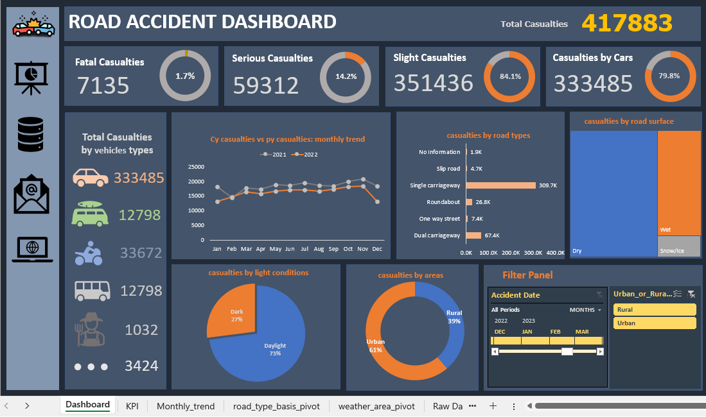

# Road Accident Dashboard
**Author:** Md Sobahan Mia

A comprehensive dashboard visualizing road accident data. This dashboard provides insights into various factors contributing to road accidents, such as casualty types, vehicle involvement, road types, environmental conditions, and more. It is designed to help understand the trends and key areas for potential road safety improvements.

## Overview

The dashboard includes the following sections:
- **Total Casualties**: Displays overall casualty statistics with a breakdown of fatal, serious, and slight casualties.
- **Casualties by Vehicle Type**: Shows the number of casualties associated with each type of vehicle, highlighting the major contributors.
- **Monthly Casualty Trends**: A line chart comparing month-by-month casualties for different years.
- **Casualties by Road Type and Surface**: Visualizations to understand the impact of road type and surface condition on casualty rates.
- **Environmental Factors**: Insights into how light conditions and urban/rural settings affect casualty numbers.
- **Filter Panel**: Provides filters to drill down into specific time periods and settings (rural or urban).

## Insights

1. **Total Casualties Overview**:
   - Total casualties recorded: **417,883**.
   - **Fatal casualties**: 7,135 (1.7%).
   - **Serious casualties**: 59,312 (14.2%).
   - **Slight casualties**: 351,436 (84.1%).

2. **Casualties by Vehicle Type**:
   - Cars are involved in the majority of casualties (**333,485**), indicating a primary area for road safety focus.
   - Other significant contributors include motorcycles (**33,672**) and bicycles (**12,798**).

3. **Monthly Casualty Trends**:
   - Casualties are fairly consistent throughout the year.
   - A noticeable decline is observed in late 2022, which may indicate seasonal factors or the effectiveness of safety interventions.

4. **Road Type and Surface Impact**:
   - **Single carriageways** have the highest casualty rate (**309.7k**), making them high-risk areas.
   - Most casualties occur on **dry surfaces**, suggesting road surface condition is important but not the only factor.

5. **Environmental Factors**:
   - **Daylight** conditions account for 73% of casualties, likely due to increased daytime traffic.
   - **Urban areas** represent 61% of casualties, while rural areas account for 39%, pointing to urban road safety concerns.

## Filters

The filter panel on the dashboard allows you to:
- Select specific **time periods** (monthly and yearly views).
- Filter by **area type** (rural or urban) to focus on relevant regions.

## Usage

This dashboard can be used by road safety authorities, urban planners, and researchers to:
- Identify high-risk areas and factors contributing to road accidents.
- Plan targeted safety interventions, especially on single carriageways and urban roads.
- Monitor trends and evaluate the impact of seasonal variations or interventions.

## Screenshot

## Technologies Used

- **Microsoft Excel / Power BI** (depending on the tool used to create this visualization).
- Data visualization techniques for dashboard insights.

## Future Enhancements

Possible improvements to this dashboard include:
- Adding more interactive filters.
- Incorporating predictive analytics for casualty trends.
- Expanding data to include more detailed demographic information.

## License

This project is licensed under the MIT License.

---

Feel free to explore and adapt this dashboard for better road safety insights!
